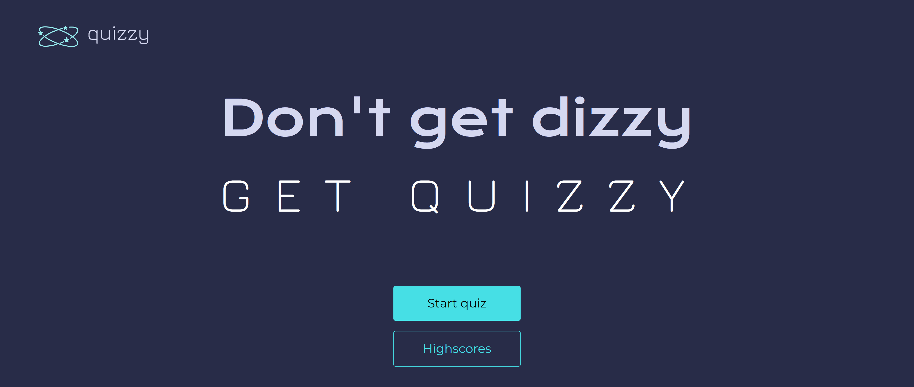
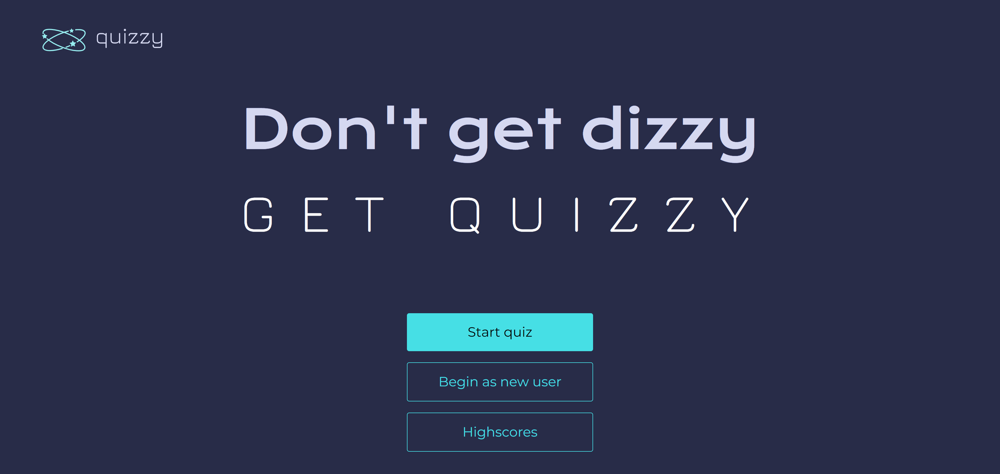
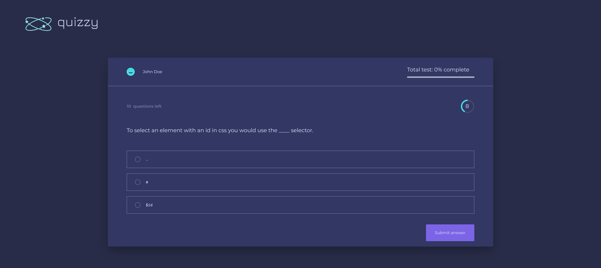
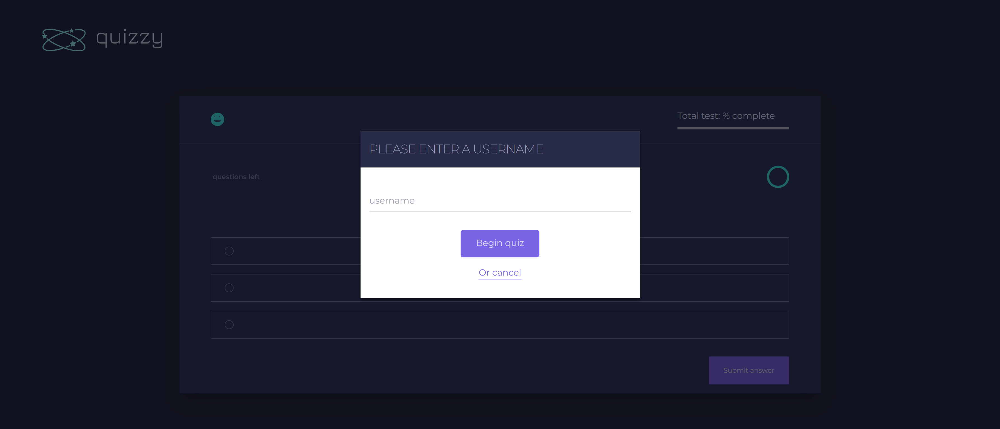
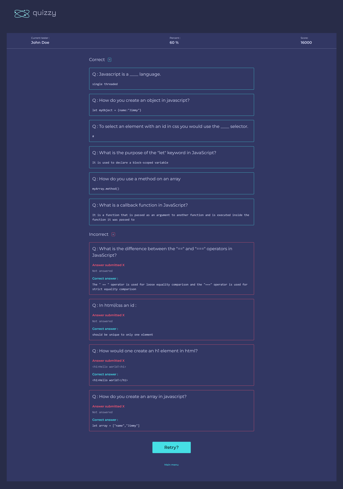
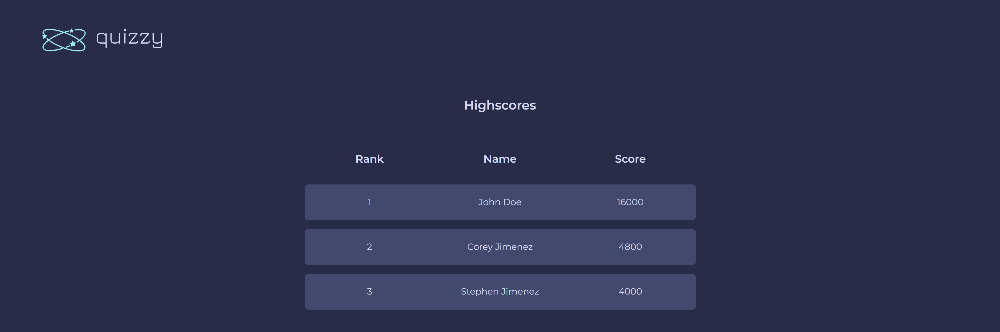

# quizzy

## Overview

`quizzy` is an app that a user will be timed and scored to answer questions about `html`, `css` and `javaScript`

### Libraries & Frameworks

- `quizzy` utilizes the `tailwind` library/framework

## Proccess

### Welcome screen

- The user is presented with a welcome screen
- There is a `Start quiz` button and a `Highscores` button
- Depending on weather or not there is a user already, the welcome screen will include a `Begin as new user` button to allow for new user creation

#### No current user

- Clicking on the `Begin quiz` button will start the quiz as a new user
- Clicking on the `Highscores` button will take you the the highscores of all users

#### Current user

- Clicking on the `Begin quiz` button will start the quiz as the current user
- Clicking on the `Begin as new user` button will start the quiz as a new user

### Quiz page

- The quiz page has an item that contains the current users name, score, test progress, a timer, how many questions left, questions, and choices

#### Starting quiz

#### Starting quiz as a new user

- Starting quiz with a new user displays a modal to get a user name
- Typing in a username and clicking `Begin quiz` will start the quiz with a new user
- `Cancel` will take you to home screen without creating new user

### Overview page

- The overview page has an element that contains data about the current user. It contains the current user name, a percent grade and a score

- The main content contains a correct section which has all the questions that are correct and an incorrect section which has all the questions that are incorrect and shows the correct answer

### Highscores page

- The highscores page contains a list of all the users that have taken the test within the localStorage

- We rank from greatest to least score

- We display the rank, name, and score

## Overview

- The website is now fully responsive to mobile
- I had alot of fun creating this app
- I was able to use quicksort for one of my functionalities

### Live Demo

[quizzy site](https://6426a2e5771562547190ac72--quizzyness.netlify.app)
